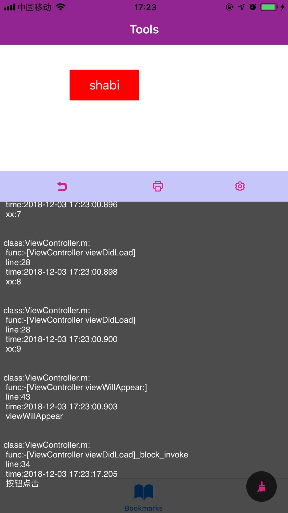

### 测试工具集 FDebugTools
打算集成一个开发测试小工具。包含日志打印、cook、IP、网络状态能测试基础信息

#### 1、Log Level
这个小工具是为了给测试或者开发人员在测试环境对某些bug进行实时反馈的小工具。比如某个接口挂了，那我们在没有联调xcode的情况下，是无知道具体的接口及错误信息。

* 目标：写一个类似小程序在调试模式下的实时控制台信息。
* 功能：
  * 1、实时显示当前Log；
  * 2、展示基本的配置信息：cookie、IP、网络状态等

来看下当前Demo的效果图:



##### 01、FLogConsoleManager 基础打印类
###### 首先对于系统的NSLog，它是一个很耗性能的方法[NSLog耗性能原因](http://blog.sunnyxx.com/2014/04/22/objc_dig_nslog/)，所以在release模式下，是不应该使用的，而小工具也是无需在release模式下展示的。所以使用

```Objective-C
#ifdef DEBUG
#define FLog(...) printf("xxx");
#else 
#define FLog(...)
#endif
```

###### 宏的使用与说明
知识点：
* `__VA_ARGS__`  可变参数的宏，宏前面加上##的作用在于，当可变参数的个数为0时，这里的##起到把前面多余的","去掉,否则会编译出错。
* `__FILE__`  宏在预编译时会替换成当前的源文件名
* `__LINE__` 宏在预编译时会替换成当前的行号
* `__FUNCTION__`  宏在预编译时会替换成当前的函数名称
* `format`  能告诉编译器，代码在处理printf的内容
* `NS_FORMAT_FUNCTION(1,2)`  参数列表，第1位是格式化字符串，从第二位参数开始计算参数列表
所以，改进一下上面的Log

```Objective-C
#define FLog(FORMAT, ...) fprintf(stderr,"\nFunction:%s Line:%d Content:%s\n", __FUNCTION__, __LINE__, [[NSString stringWithFormat:FORMAT, ##__VA_ARGS__] UTF8String])
```

###### 使用
一个打印文件、函数、行数、参数的宏
```Objective-C
#ifdef DEBUG
#define FLog(frmt, ...) Log_objc(frmt, ##__VA_ARGS__)
#else
#define FLog(frmt, ...)
#endif

#define Log_objc(frmt, ...)     \
Log_func(__PRETTY_FUNCTION__, frmt, ##__VA_ARGS__)

#define Log_func(fnct,frmt,...)     \
do{ if(1 & 1) Log(__FILE__, fnct, frmt, ##__VA_ARGS__); } while(0)

#define Log(file,fnct,frmt, ...)     \
[[FLogConsoleManager shareInstance] logFile : file     \
func : fnct     \
line : __LINE__     \
format : (frmt), ##__VA_ARGS__]
```

##### 02、文件管理类FLogFileManager
###### 文件安全性保证应该是多读单写的性质。另外需要了解的知识点有：
知识点：
* FileManager是对文件的操作，比如创建、移动、删除等
* FileHandle是对文件内容的操作，比如大小、追加字节等
* dispatch_barrier_async 虽然是异步执行，但是会保证之前的任务会先于当前任务执行，之后任务会后于当前任务执行。所以它只在并发队列中有效，其他队列和dispatch_async一样。[简书](https://www.jianshu.com/p/ff444d664e51)

所以write的代码如下：

```Objective-C
__block BOOL isSuccess;
    dispatch_barrier_sync(_queue, ^{
        if ([self isExitsAtPath:path]){
            NSFileHandle * fileHandle = [NSFileHandle fileHandleForUpdatingAtPath:path];
            [fileHandle seekToEndOfFile]; //将字节跳到文件末尾
            [fileHandle writeData:[((NSString *)content) dataUsingEncoding:NSUTF8StringEncoding]];
            [fileHandle closeFile];
            isSuccess = YES;
        }else{
            //第一次写入文件
            NSError * error;
            isSuccess = [content writeToFile:path atomically:YES encoding:NSUTF8StringEncoding error:&error];
            if (error) {
                NSLog(@"%@", error.localizedDescription);
            }
        }
    });
    return isSuccess;
```

###### 文件监听
因为当level显示在窗口时需要实时显示日志的内容。而显示期间也有日志在不间断地写入到文件中，所以对文件内容变化的掌握能让level层永远显示最新的日志。
在当前demo中，有大概三种方式实现这个功能
1、在写入成功后发出通知，让level显示层主动调用读取日志的函数。
2、在level层写一个定时器，每隔一定时间进行日志的读取
3、使用GCD对文件内容进行监听，每当监听到内容变化时，发出信号
毫无疑问，最好的手法应该是第一种和第三种。这里为了学习一下新技能，所以使用第三种方法试一下。
知识点：
dispatch_source 事件源，可以捕捉系统底层事件发生。可以查看这位同学的[简书](https://www.jianshu.com/p/aeae7b73aee2)进行了解
```Object-C
- (void)startMonitorFile {
    
    NSURL *directoryURL = [NSURL URLWithString:[self path]];
    int const fd =
    open([[directoryURL path] fileSystemRepresentation], O_EVTONLY); //O_EVTONLY：仅为事件通知请求的描述符 notifications only */
    if (fd < 0) {
        NSLog(@"Unable to open the path = %@", [directoryURL path]);
        return;
    }
    dispatch_source_t source =
    dispatch_source_create(DISPATCH_SOURCE_TYPE_VNODE, fd,
                           DISPATCH_VNODE_WRITE,
                           DISPATCH_TARGET_QUEUE_DEFAULT); //创建事件源
    __weak typeof(FLogFileManager *)weakself = self;
    dispatch_source_set_event_handler(source, ^() { //监听信号回调
        __strong typeof(FLogFileManager *)strongSelf = weakself;
        unsigned long const type = dispatch_source_get_data(source);
        switch (type) {
            case DISPATCH_VNODE_WRITE: {
                NSLog(@"目录内容改变!!!\n");
                if (strongSelf.fileDidChanged){
                    strongSelf.fileDidChanged();
                }
                break;
            }
            default:
                break;
        }
    });
    dispatch_source_set_cancel_handler(source, ^{
        close(fd);
    });
    self.source = source;
    dispatch_resume(self.source);
}
```

OK，基本日志系统就告一段落了，后续持续更新优化。如果您喜欢或者觉得有帮助请给个小❤️❤️吧！

